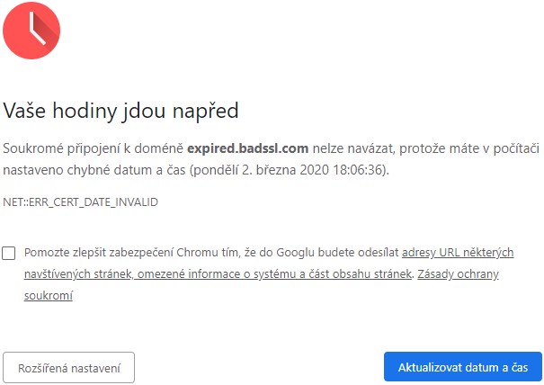
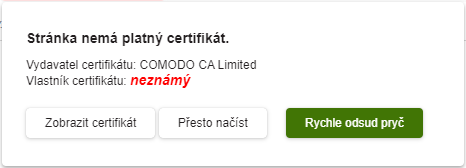
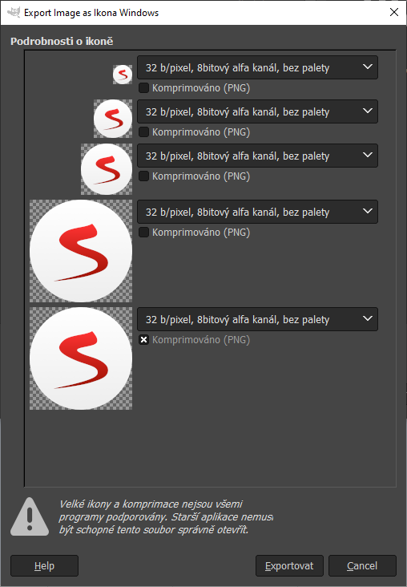
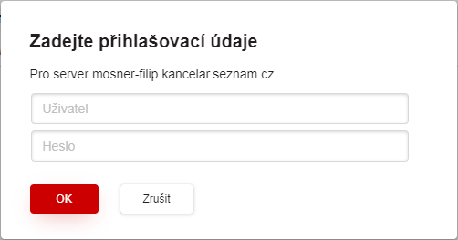
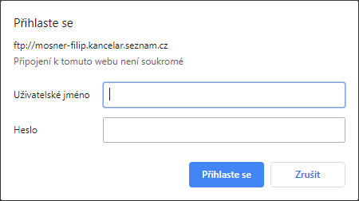

# NW.js Custom Changes

After successful standard NW.js binaries build, there are implemented existing custom changes. Changes are related to [core-chromium](https://gitlab.seznam.net/sbrowser/software/core-chromium) repository and [core-nw](https://gitlab.seznam.net/sbrowser/software/core-nw) repository.
- [sbrowser/software/core-chromium](https://gitlab.seznam.net/sbrowser/software/core-chromium) repository is forked from [nwjs/chromium.src](https://github.com/nwjs/chromium.src)
- [sbrowser/software/core-nw](https://gitlab.seznam.net/sbrowser/software/core-nw) repository is forked from [nwjs/nw.js](https://github.com/nwjs/nw.js)
- [v8](https://github.com/nwjs/v8) repository stays unchanged
- [node](https://github.com/nwjs/node) repository stays unchanged

| Local Path | Remote Repository |
|-|-|
| src | [https://gitlab.seznam.net/sbrowser/software/core-chromium](https://gitlab.seznam.net/sbrowser/software/core-chromium.git) |
| src/content/nw | [https://gitlab.seznam.net/sbrowser/software/core-nw](https://gitlab.seznam.net/sbrowser/software/core-nw.git) |
|src/v8| https:/&#8203;/github.com/nwjs/v8 |
|src/third_party/node-nw| https:/&#8203;/github.com/nwjs/node |

## Cherry-picking

To apply specific changes to current branch, we cherry-picks single commits from previous branch. All these commits are in the table below.

| Cherry-pick | chromium.src Commit | nw.js Commit | Doc | Test |
|-|-|-|-|-|
| Allow create webview in new process | [v0.43.2](https://github.com/michalvasek/chromium.src/commit/497c68b99b83fd83bee396cfe24d92ccee34bc61) | `N/A` | [NWjs_Custom_Changes](#allow-create-webview-in-new-process) | [NWjs_Testing](NWjs_Testing.MD#run-nwjs-tests) |
| SSL state change invokes 'sslchange' event | [v0.43.2](https://github.com/michalvasek/chromium.src/commit/43e0a11dd949957d32a6ded141293fa2fb9705fb) | `N/A` | [NWjs_Custom_Changes](#ssl-state-change-invokes-sslchange-event) | [NWjs_Testing](NWjs_Testing.MD#run-nwjs-tests) |
| Default files opening | [v0.43.2](https://github.com/michalvasek/chromium.src/commit/41127e349d5a85e7aacb2055c8615c2e242807a2) | `N/A` | [NWjs_Custom_Changes](#default-files-opening) | No |
| Chrome-like page is hidden | [v0.43.2](https://github.com/michalvasek/chromium.src/commit/96a3aa18b8610845fbf6b331ce232dfca20f6916) | `N/A` | [NWjs_Custom_Changes](#chrome-like-page-is-hidden) | No |
| Occasional crash with permission requests | [v0.43.2](https://github.com/michalvasek/chromium.src/commit/978ce13769b601de9657f54bb4a14f4eb43f7467) | `N/A` | [NWjs_Custom_Changes](#occasional-crash-with-permission-requests) | No |
| Partition ID to identify download | [v0.43.2](https://github.com/michalvasek/chromium.src/commit/668e0113c6b008e5ce309dd184710615deb25ac4) | `N/A` | [NWjs_Custom_Changes](#partition-id-to-identify-download) | [NWjs_Testing](NWjs_Testing.MD#run-nwjs-tests) |
| Certificate fix | [v0.43.2](https://github.com/michalvasek/chromium.src/commit/45075cbfd5ca9d15c439edb7c574c054f433185d) | `N/A` | [NWjs_Custom_Changes](#certificate-fix) | No |
| Always use automatic certificate handling | [v0.43.6](https://github.com/michalvasek/chromium.src/commit/26ab6e41175399ba1b4d310f7992dc7b13f9f485) | `N/A` | [NWjs_Custom_Changes](#always-use-automatic-certificate-handling) | No |
| Occasional new windows crash from javascript on click | [v0.43.2](https://github.com/michalvasek/chromium.src/commit/2e3a7cb7a600cc457aa726be23e91e789bd8877d) | `N/A` | [NWjs_Custom_Changes](#occasional-new-windows-crash-from-javascript-on-click) | No |
| On title and favicon change event | [v0.43.2](https://github.com/michalvasek/chromium.src/commit/c1e61d7ad68a08c9504f7186827d0fc2283d4d2c) | `N/A` | [NWjs_Custom_Changes](#on-title-and-favicon-change-event) | [NWjs_Testing](NWjs_Testing.MD#run-nwjs-tests) |
| Show certificate details | [v0.43.2](https://github.com/michalvasek/chromium.src/commit/1c34a660d8099728bb3735504545458a578abf4c) | `N/A` | [NWjs_Custom_Changes](#show-certificate-details) | No |
| Event \`targeturlupdate\` with \`targetUrl\` parameter | [v0.43.2](https://github.com/michalvasek/chromium.src/commit/2d3521b8c28d3ab5f74ef80773d9a13bb3a8c00c) | `N/A` | [NWjs_Custom_Changes](#event-targeturlupdate-with-targeturl-parameter) | [NWjs_Testing](NWjs_Testing.MD#run-nwjs-tests) |
| Webview navigation history | [v0.43.2](https://github.com/michalvasek/chromium.src/commit/451aad25c311d58b75a8280823b82479fde2251c) | `N/A` | [NWjs_Custom_Changes](#webview-navigation-history) | [NWjs_Testing](NWjs_Testing.MD#run-nwjs-tests) |
| Occasional crash related to zoom | [v0.43.2](https://github.com/michalvasek/chromium.src/commit/ff234b964262db4c79a2d62ce84f08903a451bf9) | `N/A` | [NWjs_Custom_Changes](#occasional-crash-related-to-zoom) | No |
| Don't zoom main window | [v0.43.2](https://github.com/michalvasek/chromium.src/commit/41c99928093ed9af8e089ec640f77490377f2cd4) | `N/A` | [NWjs_Custom_Changes](#dont-zoom-main-window) | No |
| Drag from webview to host window | [v0.43.2](https://github.com/michalvasek/chromium.src/commit/c95c2cb16c3d37ee3a97abbc59f0115bb385eefb) | `N/A` | [NWjs_Custom_Changes](#drag-from-webview-to-host-window) | No |
| Seznam.cz file description and product name | [v0.43.2](https://github.com/michalvasek/chromium.src/commit/e0dece69f6588aa36761f299b995815a637a8418) | `N/A` | [NWjs_Custom_Changes](#seznamcz-file-description-and-product-name) | No |
| Selenium tests | `N/A` | [v0.43.2](https://github.com/michalvasek/nw.js/commit/17dfe191fecab9a90fd5261e64e4bc92064c5528) | [NWjs_Custom_Changes](#selenium-tests) | No |
| Documentation | `N/A` | [v0.43.2](https://github.com/michalvasek/nw.js/commit/204bc4a2af3f76c197ef9de96ecf46b5c9daa4d1) | [NWjs_Custom_Changes](#documentation) | No |
| Occasional pop-up window close crash | `N/A` | [v0.43.2](https://github.com/michalvasek/nw.js/commit/2ed8491a330034a3739f2b042758c7a529a97a1a) | [NWjs_Custom_Changes](#occasional-pop-up-window-close-crash) | No |
| Default browser | [v0.43.2](https://github.com/michalvasek/chromium.src/commit/f96042006e8247b9381808c47ea93bc2fcd95f5f) | [v0.43.2](https://github.com/michalvasek/nw.js/commit/4f1918c2a8047a3371fa69e6ee83c4be6c1c8cc2) | [NWjs_Custom_Changes](#default-browser) | [NWjs_Testing](NWjs_Testing.MD#run-nwjs-tests) |
| Seznam.cz icon and Seznam.cz App ID | [v0.43.2](https://github.com/michalvasek/chromium.src/commit/f40de90ddc7c4ca4dd7b282a93176387ca0c9e65) | [v0.43.2](https://github.com/michalvasek/nw.js/commit/c94fddba5f0857d8ceee3d47812dc0cc70dd17d5) | [NWjs_Custom_Changes](#seznamcz-icon-and-seznamcz-app-id) | No |
| Get browser registry ID | `N/A` | [v0.43.2](https://github.com/michalvasek/nw.js/commit/d39eb573afd97f6dbae4fd82ef7c1aae280949a7) | [NWjs_Custom_Changes](#get-browser-registry-id) | [NWjs_Testing](NWjs_Testing.MD#run-nwjs-tests) |
| Register browser | [v0.43.2](https://github.com/michalvasek/chromium.src/commit/d196a15ad867f367784243e5c66d654e694eed86) | [v0.43.2](https://github.com/michalvasek/nw.js/commit/e4b5f3d03aa826e553226c1137a4f0deaca01f77) | [NWjs_Custom_Changes](#register-browser) | No |
| Push messaging migration to FCM | [v0.43.2](https://github.com/michalvasek/chromium.src/commit/3db6bebf211eab55c6c63b1cd410ffc4b4ed9adb) | `N/A` | [NWjs_Custom_Changes](#push-messaging-migration-to-fcm) | No |
| Geolocation caching | [v0.43.2](https://github.com/michalvasek/chromium.src/commit/b50ae90343bda845c407531972c020bb4e553ea4) | `N/A` | [NWjs_Custom_Changes](#geolocation-caching) | No |
| Geolocation caching debug | [v0.43.2](https://github.com/michalvasek/chromium.src/commit/f1f795091e6bb60987aebc4b5eb2a6a21ae75930) | `N/A` | [NWjs_Custom_Changes](#geolocation-caching-debug) | No |
| Restore navigation history | [v0.43.2](https://github.com/michalvasek/chromium.src/commit/6c19de53b9cfbf5c8a770caf0b1dfc32f2d2321e) | `N/A` | [NWjs_Custom_Changes](#restore-navigation-history) | [NWjs_Testing](NWjs_Testing.MD#run-nwjs-tests) |
| Permission request for notification | [v0.43.2](https://github.com/michalvasek/chromium.src/commit/35f563a92ac28a4b3fa44bb997138c2bc57153fc) | `N/A` | [NWjs_Custom_Changes](#permission-request-for-notification) | [NWjs_Testing](NWjs_Testing.MD#run-nwjs-tests) |
| Flags setting | `N/A` | [v0.43.2](https://github.com/michalvasek/nw.js/commit/2964e525975b36a06ead2822f94b754720188391) | [NWjs_Custom_Changes](#flags-setting) | [NWjs_Testing](NWjs_Testing.MD#run-nwjs-tests) |
| Unregister browser | `N/A` | [v0.43.2](https://github.com/michalvasek/nw.js/commit/4ffff123bc5ee5a75e079d98993d8c65d21e102d) | [NWjs_Custom_Changes](#unregister-browser) | No |
| SQLite namespace | [v0.43.2](https://github.com/michalvasek/chromium.src/commit/6a83a91d300bea483df718d7d964d94bec6c143c) | [v0.43.2](https://github.com/michalvasek/nw.js/commit/693bbdeae5ab0222e58d578726ee9b6c416a9c4e) | [NWjs_Custom_Changes](#sqlite-namespace) | [NWjs_Testing](NWjs_Testing.MD#run-nwjs-tests) |
| Widevine CDM | [v0.42.6](https://github.com/michalvasek/chromium.src/commit/c51993adac46f30c1a1faddb077f14b488ec4add) | `N/A` | [NWjs_Custom_Changes](#widevine-cdm) | No |
| Notification toast flag | [v0.43.6](https://github.com/michalvasek/chromium.src/commit/7afdb31c7f4d0a898caaa1cb8829c44ffb7d5ca3) | [v0.43.6](https://github.com/michalvasek/nw.js/commit/fbe082af04814ee5a306b5e9a0ce6b4879f88b60) | [NWjs_Custom_Changes](#notification-toast-flag) | [NWjs_Testing](NWjs_Testing.MD#run-nwjs-tests) |
| Cancel login dialog | [v0.43.6](https://github.com/michalvasek/chromium.src/commit/621dd903c8245c6a5b31ec78e52c2f34b46c9f05) | `N/A` | [NWjs_Custom_Changes](#cancel-login-dialog) | No |
| Custom AppUserModelId from package.json | [v0.47.0](https://gitlab.seznam.net/sbrowser/software/core-chromium/-/commit/8e3b9ff055d1ba190d5f8c171d65a80903355b5f) | `N/A` | [NWjs_Custom_Changes](#custom-appusermodelid-from-packagejson) | No |
| Seznam suffix in version | `N/A` | [v0.43.2](https://github.com/michalvasek/nw.js/commit/7e245f8cbb6f0f523443f0786e93c01c9e7d6855) | [NWjs_Custom_Changes](#seznam-suffix-in-version) | No |

### Allow create webview in new process

Argument `usenewprocess` added on webview. If used it ensure that webview is started in new process. If not used chrome will decide whether or not new process will be used.

**Commit message**
  ```
  Allow create webview in new process.
  -Attribute 'usenewprocess' added on webview. If used it ensure that webview is started in new process. If not used chrome will decide whether or not new process will be used.
  ```

### SSL state change invokes 'sslchange' event

Code:
```javascript
/**
 * @typedef {Object} CertificateObject
 * @property {string} fingerprint
 * @property {Object} issuer
 * @property {Number} status
 * @property {Object} subject
 * @property {string} url
 */

/**
 * SSL change event
 * @event webview#sslchange
 * @type {Event} - extended by:
 * @property {CertificateObject[]} certificate - certificates
 */
```

**Commit message**
  ```
  'sslchange' event on webview is invoked when SSL state is changed.
  ```

### Default files opening

**Commit message**
  ```
  Fix of default file opening (*.htm and *.html files).
  ```

### Chrome-like page is hidden

**Commit message**
  ```
  'This site can’t be reached' chrome-like page is hidden.
  ```

### Occasional crash with permission requests

**Commit message**
  ```
  Fix occasional crash with permission requests on webview.
  ```

### Partition ID to identify download

`DownloadItem` in `chrome.downloads.onCreated` event now contains `partitionId` string.

**Commit message**
  ```
  PartitionId added to options in chrome.downloads.download. For identifying where downloads were created.
  ```

### Certificate fix

Argument `useautomaticcerthandling` is added on webview, if allowed automatic handling needs to be used (not possible to handle it for users). Otherwise works as in Chrome.

Method `allowCertificate` allows to load page with wrong certificate.

Code:
```javascript
/**
 * Certificate error event
 * @event webview#oncertificateerror
 * @type {Event} - extended by:
 * @property {CertificateObject[]} certificate - certificates
 */

/**
 * Subframe certificate error event
 * @event webview#subframecertificateerror
 * @type {Event} - extended by:
 * @property {CertificateObject[]} certificate - certificates
 */
```

See [CertificateObject](#ssl-state-change-invokes-sslchange-event) for more info.

Example:
```javascript
webview.allowCertificate();
```

**Commit message**
  ```
  Certificate fix:
  -Webview now has:
  --Attribute 'useautomaticcerthandling' added on webview. If allowed following needs to be used (not possible to handle it for users)
  --onCertificateError event (when page with invalid certificate is opened)
  --allowCertificate function (to allow page with invalid certificate)
  -Don't load subframes with invalid certificate.
  --'subframecertificateerror' event on webview added (when page containing subframe with invalid certificate is opened).
  ```

### Always Use Automatic Certificate Handling

There is no more option to show *"Chromium message"* in case of invalid certificate. Member variable `useautomaticcerthandling` is set to `true` by default. Therefore always *"Seznam message"* is shown in case of invalid certificate.

- Chromium message

  

- Seznam message

  

**Commit message**
```
Always use automatic certificate handling. Member variable 'useautomaticcerthandling' is set to 'true' by default.
```

### Occasional new windows crash from javascript on click

**Commit message**
  ```
  Hot-fix of occasional crash related to new windows/popups created from javascript on click.
  ```

### On title and favicon change event

Code:
```javascript
/**
 * Favicon change event
 * @event webview#faviconchange
 * @type {Event} - extended by:
 * @property {string} faviconUrl - favicon URL
 */

/**
 * Title change event
 * @event webview#titlechange
 * @type {Event} - extended by:
 * @property {string} title - URL title
 */
```

Example:
```javascript
webview.addEventListener('faviconchange', (evt) => {
  console.log(evt.faviconUrl);
});
```

**Commit message**
  ```
  On title and favicon change event on webview:
  -titlechange
  -faviconchange
  ```

### Event \`targeturlupdate\` with \`targetUrl\` parameter

Code:
```javascript
/**
 * Target URL update event
 * @event webview#targeturlupdate
 * @type {Event} - extended Event by:
 * @property {string} targetUrl - URL target
 */
```

**Commit message**
  ```
  Event `targeturlupdate` with `targetUrl` parameter on hover url change.
  ```

### Show certificate details

Method `showCurrentCertificateDetails` invokes on webview current native certificate details window, if there is some certificate on current page. Otherwise nothing will happen.

**Commit message**
  ```
  Show certificate details:
  On webview invoke current native certificate details window (if there is some certificate on current page otherwise nothing will happen):
  showCurrentCertificateDetails()
  ```

Example:
```javascript
webview.showCurrentCertificateDetails()
```

### Webview navigation history

Method `getPagesHistory` returns array of URLs, titles and favicons of pages in history. Titles and favicons are not known for current page because array is created before page is fully loaded.

Method `getCurrentHistoryIndex()` returns current history index.

Code:
```javascript
/**
 * @typedef {Object} HistoryList
 * @property {string} favicon
 * @property {string} title
 * @property {string} url
 */

/**
 * @return {HistoryList[]}
 */
 getPagesHistory() { /* ... */ }
```

```javascript
/**
 * @return {Number} - index from zero
 */
 getCurrentHistoryIndex() { /* ... */ }
```

**Commit message**
  ```
  Webview navigation history getter.
  
  Webview now has:
  -getPagesHistory function, returning array of URLs, titles and favicons of pages in history. Titles and favicons are not known for current page because array is created before page is fully loaded.
  -getCurrentHistoryIndex function, returning current history index
  ```

### Occasional crash related to zoom

**Commit message**
  ```
  Hot-fix of occasional crash related to zoom.
  ```

### Don't zoom main window

**Commit message**
  ```
  Zoom fix: Don't zoom main window.
  ```

### Drag from webview to host window

**Commit message**
  ```
  Hotfix: Enable to drag from webview to host window.
  ```

### Seznam.cz file description and product name

**Commit message**
  ```
  Change file description and product name to Seznam.cz.
  ```

### Selenium tests

NW.js provide a customized ChromeDriver for automated testing NW.js based apps. You can use it with tools like selenium. Selenium automates browsers. All tests related to our custom changes are stored in this commit.

For more information see [NWjs_Testing](NWjs_Testing.MD#run-nwjs-tests) documentation.


**Commit message**
  ```
  Selenium tests
  ```

### Documentation

**Commit message**
  ```
  Documentation
  ```

### Occasional pop-up window close crash

**Commit message**
  ```
  Hot-fix of occasional crash when pop-up window was closed.
  ```

### Default browser

It is possible to find out and set default browser via `nw.App.isDefaultBrowser` function and `nw.App.setDefaultBrowser` function.

**Commit message**
  ```
  Default browser. It is possible to check whether nwjs is default browser or set as default browser via these function:
  - nw.App.isDefaultBrowser
  - nw.App.setDefaultBrowser
  ```

### Seznam.cz icon and Seznam.cz App ID

Icon graphics is replaced, 3x `ICNS` file, 2x `ICO` file and 7x `PNG` file. `PNG` files are encoded in 32-bit format (ARGB). `ICO` files contains 5 layers.
- `src/chrome/app/theme/chromium/mac/app.icns`
- `src/chrome/app/theme/chromium/mac/document.icns`
- `src/chrome/app/theme/chromium/product_logo_128.png`
- `src/chrome/app/theme/chromium/product_logo_22_mono.png`
- `src/chrome/app/theme/chromium/product_logo_24.png`
- `src/chrome/app/theme/chromium/product_logo_256.png`
- `src/chrome/app/theme/chromium/product_logo_48.png`
- `src/chrome/app/theme/chromium/product_logo_64.png`
- `src/chrome/app/theme/chromium/win/chromium.ico`
- `src/content/nw/src/mac/nw.icns`
- `src/content/nw/src/resources/default_100_percent/nw.png`
- `src/content/nw/src/resources/nw.ico`

There are 3 types of file.
- An `ICNS` file is an icon file used by macOS applications.
- Files with the `ICO` extension are commonly used by the Microsoft Windows operating system in order to display a picture that is used for a computer icon.
- A `PNG` file is an image saved in the Portable Network Graphic format.

For further file modification use GIMP tool.

  

In the file `src\chrome\browser\profiles\profile_shortcut_manager_win.cc` increment the constant `kCurrentProfileIconVersion` by 1. Incrementing this number will cause profile icons to be regenerated on profile startup (it should be incremented whenever the product/avatar icons change, etc).

**Commit message**
  ```
  Seznam.cz icon and Seznam.cz App id instead nwjs.
  ```

### Get browser registry ID

Browser ID used in registry is needed for utility default browser settings in Win8 and Win10. This browser ID can be get via `nw.App.getBrowserRegistryId` function.

**Commit message**
  ```
  Getting browser registry Id via function: nw.App.getBrowserRegistryId()
  ```

### Register browser

It is possible to register browser to operating system via `nw.App.registerBrowser` function.

**Commit message**
  ```
  Register browser. It is possible to register via "nw.App.registerBrowser" function.
  ```

### Push messaging migration to FCM

**Commit message**
  ```
  push messaging migration to FCM
  ```

### Geolocation caching

**Commit message**
  ```
  geocache
  ```

### Geolocation caching debug

File `src\base\debug\szn.h` includes log message features. `AddLogMessage` function creates/edits `szn_debug.log` file. To use these debug log features, build binaries with `SZN_DEBUG` flag.

- Re-run the `GN` to make a build directory `src\out\nw\obj\services\device\geolocation\geolocation.ninja`
  ```
  > gn gen out/nw
  ```

- Add flag `SZN_DEBUG` to appropriate `.ninja` file, e.g. `src\out\nw\obj\services\device\geolocation\geolocation.ninja`
  ```
  defines = -DSZN_DEBUG -DUSE_AURA=1
  ...
  ```

- Build binaries
  ```
  > ninja -C out/nw nwjs
  ```

**Commit message**
  ```
  geocache debug
  ```

### Restore navigation history

It is possible to insert history to newly created webview via `restoreHistory` method. Webview should be newly created on `about:blank` page.

On webview:
```javascript
/**
 * @params {Number} index - set webview to index page, indexed from 0 (zero)
 * @params {Object[]} pages - array pages
 * @return {boolean}
 */
 restoreHistory(index, pages) { /* ... */ }
```

Example:
```javascript
// set to novinky.cz
webview.restoreHistory(1, [
 { url: "https://www.seznam.cz/", title: "Seznam - najdu tam, co neznm" },
 { url: "https://www.novinky.cz/", title: "Novinky.cz   nejtenj zprvy na eskm internetu" },
 { url: "https://www.seznam.cz/", title: "Seznam - najdu tam, co neznm" }
]);
```

**Commit message**
  ```
  Restore navigation history on webview. It is possible to insert history to newly created webview via 'restoreHistory' function.
  ```

### Permission request for notification

Works the same as other permission request see: [https://developer.chrome.com/apps/tags/webview#event-permissionrequest](https://developer.chrome.com/apps/tags/webview#event-permissionrequest) permission name is `notification`.

**Commit message**
  ```
  Quick implementation of permission request for notification.
  ```

### Flags setting

It is possible to get and set javascript API flags via `nw.App.getFlagsSetting` function and `nw.App.setFlagsSetting` function.

To reset all arguments call setter with empty array.

In setter all arguments should be passed. If any argument previously setted it needs to be there or it will be reseted. To add arguments you need to get arguments from getter add new arguments and call setter.

Optional callback in setter returns all setted arguments if any argument is missing it means it was invalid.

To disable hardware video acceleration use `disable-accelerated-video-decode` argument.

**Commit message**
  ```
  Flags setting javascript API:
  -nw.App.setFlagsSetting(string[] argList, optional callback(string[] argList))
  -nw.App.getFlagsSetting(optional callback(string[] argList))
  ```

### Unregister browser

**Commit message**
  ```
  Unregister browser. It is possible to unregister via "nw.App.unregisterBrowser" function.
  ```

### SQLite namespace

**Commit message**
  ```
  SQLite namespace
  ```

### Widevine CDM

**Commit message**
  ```
  Widevine CDM
  ```

### Notification toast flag

Toast, passive pop-up or simply notification is a graphical control element that communicates certain events to the user.

Because there is missing `notification` type of permission request, it is not possible to fire [permissionrequest](https://developer.chrome.com/apps/tags/webview#event-permissionrequest) event when the guest page needs to request special permission from the embedder.

This hotfix allows to `allow` / `disable` notification toast per host like `web.whatsapp.com` or `www.facebook.com` using permission list. Host can be added to or removed from the permission list via javascript API `nw.App.setNotificationToastFlag` function. Check for host status via `nw.App.getNotificationToastFlag` function.

- Notification toast is not displayed, if the host has record in the permission list and has the status set to `deny`.
- Add host and status to the permission list. Set status to `allow` or `deny`.
  ```javascript
  nw.App.setNotificationToastFlag("web.whatsapp.com", "allow", console.log);
  nw.App.setNotificationToastFlag("www.facebook.com", "deny", console.log);
  ```
- Remove host from the permission list. Set status to `default`.
  ```javascript
    nw.App.setNotificationToastFlag("web.whatsapp.com", "default", console.log);
  ```
- Each host is set to `default` by default, because it has no record in the permission list at the beggining.
- Check for status.
  ```javascript
  > nw.App.getNotificationToastFlag("www.facebook.com", console.log);
    deny
  > nw.App.getNotificationToastFlag("www.messenger.com", console.log);
    default
  ```

**Commit message**
  ```
  Notification toast flag. It is possible to set notification flag to "allow" / "deny" via these function:
    - nw.App.getNotificationToastFlag
    - nw.App.setNotificationToastFlag
  ```

### Cancel login dialog

Do not show Chrome login dialog after sBrowser login dialog.

- Seznam login dialog

  

- Chrome login dialog

  

**Commit message**
  ```
  Cancel login dialog
  
  - Do not show Chrome login prompt for requested URL
  - Call CancelAuth() function
  ```

### Custom AppUserModelId from package.json

Automatically sets specific AppUserModelId for every browser window. The Id is specified in file `package.json` and variable `name`. If file or variable doesn’t exist, default id is used.

**Commit message**
  ```
  Custom AppUserModelId from package.json
  ```

### Seznam suffix in version

**Commit message**
  ```
  Seznam suffix in version.
  ```

## Extension Function List

### nw.App namespace

| Extension function (nw_app_api.h) | Interface Function (nw_app.idl) | chromium.src Commit | nw.js Commit | Doc |
|-|-|-|-|-|
| ```nw.App.isDefaultBrowser```         | ```void isDefaultBrowser(StringCallback);```                               | [v0.43.2](https://github.com/michalvasek/chromium.src/commit/f96042006e8247b9381808c47ea93bc2fcd95f5f) | [v0.43.2](https://github.com/michalvasek/nw.js/commit/4f1918c2a8047a3371fa69e6ee83c4be6c1c8cc2) | [NWjs_Custom_Changes](#default-browser) |
| ```nw.App.setDefaultBrowser```        | ```void setDefaultBrowser(StringCallback);```                              | [v0.43.2](https://github.com/michalvasek/chromium.src/commit/f96042006e8247b9381808c47ea93bc2fcd95f5f) | [v0.43.2](https://github.com/michalvasek/nw.js/commit/4f1918c2a8047a3371fa69e6ee83c4be6c1c8cc2) | [NWjs_Custom_Changes](#default-browser) |
| ```nw.App.getBrowserRegistryId```     | ```DOMString getBrowserRegistryId();```                                    | `N/A`                                                                                                  | [v0.43.2](https://github.com/michalvasek/nw.js/commit/d39eb573afd97f6dbae4fd82ef7c1aae280949a7) | [NWjs_Custom_Changes](#get-browser-registry-id) |
| ```nw.App.registerBrowser```          | ```void registerBrowser(BooleanCallback);```                               | [v0.43.2](https://github.com/michalvasek/chromium.src/commit/d196a15ad867f367784243e5c66d654e694eed86) | [v0.43.2](https://github.com/michalvasek/nw.js/commit/e4b5f3d03aa826e553226c1137a4f0deaca01f77) | [NWjs_Custom_Changes](#register-browser) |
| ```nw.App.getFlagsSetting```          | ```void getFlagsSetting(ObjectsCallback);```                               | `N/A`                                                                                                  | [v0.43.2](https://github.com/michalvasek/nw.js/commit/2964e525975b36a06ead2822f94b754720188391) | [NWjs_Custom_Changes](#flags-setting) |
| ```nw.App.setFlagsSetting```          | ```void setFlagsSetting(DOMString[], optional ObjectsCallback);```         | `N/A`                                                                                                  | [v0.43.2](https://github.com/michalvasek/nw.js/commit/2964e525975b36a06ead2822f94b754720188391) | [NWjs_Custom_Changes](#flags-setting) |
| ```nw.App.unregisterBrowser```        | ```void unregisterBrowser(BooleanCallback);```                             | `N/A`                                                                                                  | [v0.43.2](https://github.com/michalvasek/nw.js/commit/4ffff123bc5ee5a75e079d98993d8c65d21e102d) | [NWjs_Custom_Changes](#unregister-browser) |
| ```nw.App.getNotificationToastFlag``` | ```void getNotificationToastFlag(DOMString, StringCallback);```            | [v0.43.6](https://github.com/michalvasek/chromium.src/commit/7afdb31c7f4d0a898caaa1cb8829c44ffb7d5ca3) | [v0.43.6](https://github.com/michalvasek/nw.js/commit/fbe082af04814ee5a306b5e9a0ce6b4879f88b60) | [NWjs_Custom_Changes](#notification-toast-flag) |
| ```nw.App.setNotificationToastFlag``` | ```void setNotificationToastFlag(DOMString, DOMString, StringCallback);``` | [v0.43.6](https://github.com/michalvasek/chromium.src/commit/7afdb31c7f4d0a898caaa1cb8829c44ffb7d5ca3) | [v0.43.6](https://github.com/michalvasek/nw.js/commit/fbe082af04814ee5a306b5e9a0ce6b4879f88b60) | [NWjs_Custom_Changes](#notification-toast-flag) |

### nw.SQLite namespace

| Extension function (nw_sqlite_api.h) | Interface Function (nw_sqlite.idl) | chromium.src Commit | nw.js Commit | Doc |
|-|-|-|-|-|
| ```nw.SQLite.getVersion```     | ```DOMString getVersion();```                                                  | [v0.43.2](https://github.com/michalvasek/chromium.src/commit/6a83a91d300bea483df718d7d964d94bec6c143c) | [v0.43.2](https://github.com/michalvasek/nw.js/commit/693bbdeae5ab0222e58d578726ee9b6c416a9c4e) | [SQLite](SQLite.MD#sqlite-version) |
| ```nw.SQLite.init```           | ```void init(DOMString, optional long, optional ObjectsCallback);```           | [v0.43.2](https://github.com/michalvasek/chromium.src/commit/6a83a91d300bea483df718d7d964d94bec6c143c) | [v0.43.2](https://github.com/michalvasek/nw.js/commit/693bbdeae5ab0222e58d578726ee9b6c416a9c4e) | [SQLite](SQLite.MD#init-sqlite) |
| ```nw.SQLite.deinit```         | ```void deinit(DOMString, optional ObjectsCallback);```                        | [v0.43.2](https://github.com/michalvasek/chromium.src/commit/6a83a91d300bea483df718d7d964d94bec6c143c) | [v0.43.2](https://github.com/michalvasek/nw.js/commit/693bbdeae5ab0222e58d578726ee9b6c416a9c4e) | [SQLite](SQLite.MD#deinit-sqlite) |
| ```nw.SQLite.execute```        | ```void execute(DOMString, DOMString, optional ObjectsCallback);```            | [v0.43.2](https://github.com/michalvasek/chromium.src/commit/6a83a91d300bea483df718d7d964d94bec6c143c) | [v0.43.2](https://github.com/michalvasek/nw.js/commit/693bbdeae5ab0222e58d578726ee9b6c416a9c4e) | [SQLite](SQLite.MD#execute-sqlite) |
| ```nw.SQLite.setBusyTimeout``` | ```void setBusyTimeout(DOMString, optional long, optional ObjectsCallback);``` | [v0.43.2](https://github.com/michalvasek/chromium.src/commit/6a83a91d300bea483df718d7d964d94bec6c143c) | [v0.43.2](https://github.com/michalvasek/nw.js/commit/693bbdeae5ab0222e58d578726ee9b6c416a9c4e) | [SQLite](SQLite.MD#set-busy-timeout) |
| ```nw.SQLite.lastID```         | ```long lastID(DOMString);```                                                  | [v0.43.2](https://github.com/michalvasek/chromium.src/commit/6a83a91d300bea483df718d7d964d94bec6c143c) | [v0.43.2](https://github.com/michalvasek/nw.js/commit/693bbdeae5ab0222e58d578726ee9b6c416a9c4e) | [SQLite](SQLite.MD#last-id) |

## Webview

### Webview event list

| Event (web_view_events.js) | chromium.src Commit | nw.js Commit | Doc |
|-|-|-|-|
| targeturlupdate | [v0.43.2](https://github.com/michalvasek/chromium.src/commit/2d3521b8c28d3ab5f74ef80773d9a13bb3a8c00c) | `N/A` | [NWjs_Custom_Changes](#event-targeturlupdate-with-targeturl-parameter) |
| sslchange |[v0.43.2](https://github.com/michalvasek/chromium.src/commit/43e0a11dd949957d32a6ded141293fa2fb9705fb) | `N/A`| [NWjs_Custom_Changes](#ssl-state-change-invokes-sslchange-event) |
| certificateerror | [v0.43.2](https://github.com/michalvasek/chromium.src/commit/45075cbfd5ca9d15c439edb7c574c054f433185d) | `N/A` | [NWjs_Custom_Changes](#certificate-fix) |
| subframecertificateerror | [v0.43.2](https://github.com/michalvasek/chromium.src/commit/45075cbfd5ca9d15c439edb7c574c054f433185d) | `N/A` | [NWjs_Custom_Changes](#certificate-fix) |
| titlechange | [v0.43.2](https://github.com/michalvasek/chromium.src/commit/c1e61d7ad68a08c9504f7186827d0fc2283d4d2c) | `N/A` | [NWjs_Custom_Changes](#on-title-and-favicon-change-event) |
| faviconchange | [v0.43.2](https://github.com/michalvasek/chromium.src/commit/c1e61d7ad68a08c9504f7186827d0fc2283d4d2c) | `N/A` | [NWjs_Custom_Changes](#on-title-and-favicon-change-event) |

### Webview argument list

| Argument (web_view_constants.js) | chromium.src Commit | nw.js Commit | Doc |
|-|-|-|-|
| usenewprocess | [v0.43.2](https://github.com/michalvasek/chromium.src/commit/497c68b99b83fd83bee396cfe24d92ccee34bc61) | `N/A` | [NWjs_Custom_Changes](#allow-create-webview-in-new-process) |
| useautomaticcerthandling | [v0.43.2](https://github.com/michalvasek/chromium.src/commit/45075cbfd5ca9d15c439edb7c574c054f433185d) | `N/A` | [NWjs_Custom_Changes](#certificate-fix) |

### Webview method list

| Method (web_view_api_methods.js) | chromium.src Commit | nw.js Commit | Doc |
|-|-|-|-|
| showCurrentCertificateDetails | [v0.43.2](https://github.com/michalvasek/chromium.src/commit/1c34a660d8099728bb3735504545458a578abf4c) | `N/A` | [NWjs_Custom_Changes](#show-certificate-details) |
| allowCertificate | [v0.43.2](https://github.com/michalvasek/chromium.src/commit/45075cbfd5ca9d15c439edb7c574c054f433185d) | `N/A` | [NWjs_Custom_Changes](#certificate-fix) |
| getPagesHistory | [v0.43.2](https://github.com/michalvasek/chromium.src/commit/451aad25c311d58b75a8280823b82479fde2251c) | `N/A` | [NWjs_Custom_Changes](#webview-navigation-history) |
| getCurrentHistoryIndex | [v0.43.2](https://github.com/michalvasek/chromium.src/commit/451aad25c311d58b75a8280823b82479fde2251c) | `N/A` | [NWjs_Custom_Changes](#webview-navigation-history) |
| restoreHistory | [v0.43.2](https://github.com/michalvasek/chromium.src/commit/6c19de53b9cfbf5c8a770caf0b1dfc32f2d2321e) | `N/A` | [NWjs_Custom_Changes](#restore-navigation-history) |