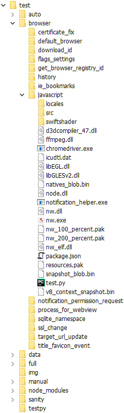
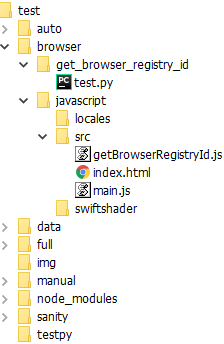

### About NW.js Selenium testing

For automated testing we use Selenium tools. 
- **Selenium** automates browsers. Primarily, it is for automating web applications for testing purposes. Selenium is a free (open source) automated testing suite for web applications.
- **ChromeDriver** is a separate executable that Selenium WebDriver uses to control Chrome.
- **NW.js** provide a customized ChromeDriver for automated testing NW.js based apps. You can use it with tools like selenium.

See test list below.

- certificate_fix
- default_browser
- download_id
- flags_settings
- get_browser_registry_id
- history
- notification_permission_request
- process_for_webview
- sqlite_namespace
- ssl_change
- target_url_update
- title_favicon_event
- notification_toast

See commit vs. test dependencies table below.

|  Repo  |  Repo  |  Git Commit  |  Test to run  |
|-|-|-|-|
|  SRC   ||  Notification toast flag.                   |  notification_toast               |
|  SRC   ||  SQLite namespace                           |  sqlite_namespace                 |
|  SRC   ||  Quick implementation of permission reque   |  notification_permission_request  |
|  SRC   ||  Restore navigation history on webview. I   |  history                          |
|  SRC   ||  Default browser. It is possible to check   |  default_browser                  |
|  SRC   ||  Webview navigation history getter.         |  history                          |
|  SRC   ||  Event `targeturlupdate` with `targetUrl`   |  target_url_update                |
|  SRC   ||  On title and favicon change event on web   |  title_favicon_event              |
|  SRC   ||  Certificate fix: -Webview now has: --Att   |  certificate_fix                  |
|  SRC   ||  PartitionId added to options in chrome.d   |  download_id                      |
|  SRC   ||  'sslchange' event on webview is invoked    |  ssl_change                       |
|  SRC   ||  Allow create webview in new process. -At   |  process_for_webview              |
||  NW    |  SQLite namespace                           |  sqlite_namespace                 |
||  NW    |  Flags setting javascript API: -nw.App.se   |  flags_settings                   |
||  NW    |  Getting browser registry Id via function   |  get_browser_registry_id          |
||  NW    |  Default browser. It is possible to check   |  default_browser                  |

### Files and folders

- Create new folder, name has to be `test`.
- Copy content of `src\content\nw\test` to the `test` folder. Our tests are stored in NW.js repository.

  | **Remote repository** | **Local subrepository** |
  | --- | --- |
  | [https://github.com/michalvasek/nw.js](https://github.com/michalvasek/nw.js.git) | src/content/nw |

- Copy builded NW.js binaries to `test\browser\javascript` folder.
- Download binaries from `https://nwjs.io` website to get `chromedriver.exe` and `node.dll`. Download appropriate version of the SDK win 32-bit ZIP like [https://dl.nwjs.io/v0.42.0/nwjs-sdk-v0.42.0-win-ia32.zip](https://dl.nwjs.io/v0.42.0/nwjs-sdk-v0.42.0-win-ia32.zip) for the v0.42.0.
- Extract `chromedriver.exe` and `node.dll` from the zip and place them into `test` folder under the same dir that contains `nw.exe`. `chromedriver.exe` is modified to find NW executable in the same directory by default.
- See final file and folder structure below.

  
  
### Creating new test

Create new test in four steps. See [Test for Get Browser Registry ID](https://github.com/michalvasek/nw.js/commit/060e2a2b2c9bcada3f482b524fc91959d59c2be3) commit like example.
- Create 2 files, `getBrowserRegistryId.js` and `test.py`.
- Modify 2 files, `index.html` and `main.js`.

  

1. Create new file `getBrowserRegistryId.js` in folder `test\browser\javascript\src`. Use `addFinalResult` method in the script to evaluate test as true or false.
- `addFinalResult("Test OK", true, 'getBrowserRegistryIdResult');`
- `addFinalResult("Test NOK", false, 'getBrowserRegistryIdResult');`
```javascript
function getBrowserRegistryIdButtonFunction() {
    var nwjsid = nw.App.getBrowserRegistryId();
    addTestResult("Browser Registry ID: " + nwjsid)
    if (/^nwjs\.\S+$/.test(nwjsid)) {
        addFinalResult("Browser Registry ID match the regexp", true, 'getBrowserRegistryIdResult');
    } else {
        addFinalResult("Browser Registry ID did not match the regexp", false, 'getBrowserRegistryIdResult');
    }
}
```
2. Modify `test\browser\javascript\index.html`, add new button element and new script source path.
```javascript
<head>
    <script type="text/javascript" src="getBrowserRegistryId.js"></script>
</head>
<body>
    <button id="getBrowserRegistryIdButton" type="button">getBrowserRegistryId test</button><br />
</body>
```
3. Modify `test\browser\javascript\main.js` with new click listener.
```javascript
document.getElementById("getBrowserRegistryIdButton").addEventListener("click", getBrowserRegistryIdButtonFunction);
```
4. Create new file `test.py` in folder `test\browser\get_browser_registry_id` to process autoclick and result evaluation while selenium testing. You can copy the script from another test, use method ```find_element_by_id``` with correct values. Method is called twice, with value ```getBrowserRegistryIdButton``` and ```getBrowserRegistryIdResult```.

```python
import time
import os

from selenium import webdriver
from selenium.webdriver.chrome.options import Options
chrome_options = Options()
chrome_options.add_argument("nwapp=" + os.path.dirname(os.path.abspath(__file__)) + "\..\javascript")

driver = webdriver.Chrome(executable_path=os.environ['CHROMEDRIVER'], chrome_options=chrome_options)
time.sleep(1)
try:
    driver.implicitly_wait(10) # 10s timeout when finding an element

    clickme = driver.find_element_by_id('getBrowserRegistryIdButton')
    clickme.click()

    result = driver.find_element_by_id('getBrowserRegistryIdResult')
    assert("success" in result.get_attribute('innerHTML'))
finally:
    driver.quit()
```

### Asynchronous vs. synchronous test execution

There are 2 kind of test approach, according to **nw API** implementation in `idl` file.

**Synchronous** example as above [Test for Get Browser Registry ID](https://github.com/michalvasek/nw.js/commit/060e2a2b2c9bcada3f482b524fc91959d59c2be3).
- nw API implementation in `src\content\nw\src\api\nw_app.idl`
   ```cpp
  static DOMString getBrowserRegistryId();
  ```
- javascript usage
  ```javascript
  var nwjsid = nw.App.getBrowserRegistryId();
  addTestResult("Browser Registry ID: " + nwjsid)
  ```

**Asynchronous** request will wait for a request to respond while the rest of the code continues to execute. Use callback while handling asynchronous operations making javascript API request. See [SQLite Namespace Test](https://github.com/michalvasek/nw.js/commit/a60cddd50190fb806886263ea4284e64db67e6f2) comit like example.
- nw API implementation in `src\content\nw\src\api\nw_sqlite.idl`
  ```cpp
  [forIOThread] static void init(DOMString db_file_path, optional long flags, optional ObjectsCallback callback);
  ```
- javascript usage
  ```javascript
  nw.SQLite.init("", (rc, data) => {
    addTestResult("Result code: " + rc);
    addTestResult("Data: " + data);
  } );
  ```

### Environment setup

- Install **Anaconda** Distribution, **Python 2.7** version.
- Use virtual environment to create isolated Python environment for selenium in `C:/venv_selenium`.
- Install selenium package.

### Run NW.js tests

Run `Command Prompt`. Go to `test/browser/javascript` folder. Update path with `C:/venv_selenium/Scripts`. Python path to virtual environment has to be first, in front of any other python paths.
  ```
  path=C:/venv_selenium/Scripts;%path%
  ```

**Run all tests** from `test/browser/javascript` folder. Every folder found in `test/browser` folder will be executed as one test. `javascript` folder is not a test. See each `test.py` file in test folders.
```
python ../../test.py -t 80 browser
```
  See all the results, e.g. 8 tests passed and 5 tests failed, `javascript` folder is not a test.
```
[02:59|% 100|+   9|-   5]: Done
```

**Run any test** from `test/browser/javascript` folder.
```
python ../../test.py -t 80 browser/get_browser_registry_id
python ../../test.py -t 80 browser/sqlite_namespace
```
- Test passed example
  ```
  python ../../test.py -t 80 browser/get_browser_registry_id
  [00:00|%   0|+   0|-   0]: release get_browser_registry_id
  [00:08|% 100|+   1|-   0]: Done
  ```

- Test failed example
  ```
  python ../../test.py -t 80 browser/get_browser_registry_id
  [00:00|%   0|+   0|-   0]: release get_browser_registry_id
  [00:09|% 100|+   0|-   1]: Done
  ```